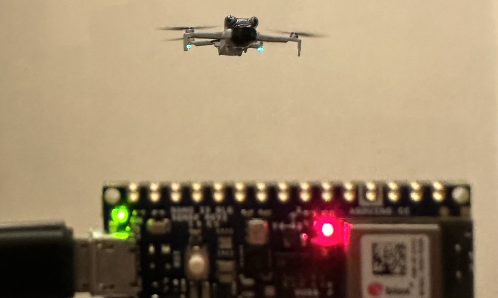
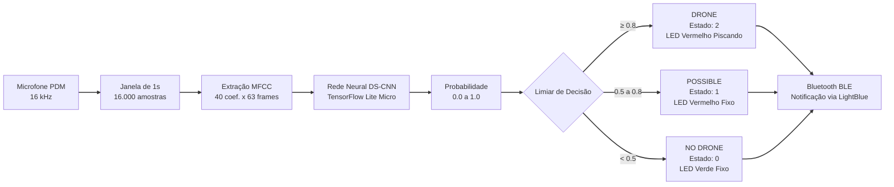

# Drone Detector — TinyML no Arduino Nano 33 BLE Sense

Detecção em tempo real do som de um drone (DJI Mini 4 Pro) usando uma rede
neural TinyML (DS-CNN) rodando **100% embarcada** em um Arduino Nano 33 BLE
Sense Rev2 — sem nuvem, sem Wi-Fi, sem servidor. Áudio captado pelo
microfone PDM onboard, processado e classificado localmente em menos de
1 segundo, com indicação visual (LED RGB) e via Bluetooth (BLE).


## Demo

- 🟢 LED verde: sem drone
- 🔴 LED vermelho sólido: drone detectado
- 🔴 LED vermelho piscando: drone detectado com alta confiança
- 📶 Bluetooth (BLE): transmite o estado e a probabilidade ao vivo, visível
  por qualquer app genérico de BLE (ex: [LightBlue](https://punchthrough.com/lightblue/))
<p align="center">
  <br>
  <em>Arduino Nano 33 BLE Sense detectando o drone em tempo real</em>
</p>

## Como funciona


O pipeline de MFCC (FFT, banco de filtros mel, DCT) é calculado **em C++
puro no Arduino**, replicando bit a bit o `librosa.feature.mfcc()` usado
no treino em Python (validado com diferença numérica < 0.002 contra o
`librosa` original — veja `python/13_export_arduino_assets.py`).

## Hardware necessário

- Arduino Nano 33 BLE Sense **Rev2**
- Cabo USB com dados (Micro-USB ou adaptador USB-C, conforme o seu PC)
- (Opcional, para reproduzir o fine-tuning) um drone para gravar áudio próprio

## Estrutura do repositório

```
.
├── python/           # Pipeline de treinamento (dataset → modelo → .tflite)
├── arduino/           # Firmware (.ino) e assets gerados (.h)
├── requirements.txt
└── README.md
```

Veja `python/README.md` e `arduino/README.md` para detalhes de cada parte.

## Dataset

Este projeto usa o **DroneAudioDataset** (binário: `yes_drone` / `unknown`),
compilado por Sara Al-Emadi et al. como parte do trabalho *"Audio Based
Drone Detection and Identification using Deep Learning"*:

> Al-Emadi, S. et al. *Audio Based Drone Detection and Identification
> using Deep Learning*. IWCMC 2019.
> Dataset: https://github.com/saraalemadi/DroneAudioDataset

O dataset **não está incluído neste repositório** — baixe diretamente do
link acima e coloque em `dataset/yes_drone/` e `dataset/unknown/` antes de
rodar `python/03_prepare_dataset.py`.

## A jornada (resumo técnico)

Esse projeto passou por algumas voltas até chegar no resultado final —
documentando aqui porque cada uma ensinou algo:

1. **Arquitetura original (~8k parâmetros, sem redução espacial)** treinou
   bem no PC (99% de acurácia no teste), mas generalizava mal em áudio
   real até um primeiro fine-tuning com gravações próprias.
2. **Tentativa de deploy via Edge Impulse (BYOM)** esbarrou em limitações
   de plano gratuito (EON Compiler pago) e estouro de RAM — o modelo
   pedia >1MB de RAM em tempo de execução porque a arquitetura nunca
   reduzia a resolução espacial dos mapas de ativação.
3. **Migração para TensorFlow Lite Micro puro** (sem Edge Impulse),
   reescrevendo a arquitetura com `strides=2` em 4 blocos, reduzindo o
   maior tensor intermediário de ~645KB para ~60KB.
4. **Um fine-tuning com áudio do celular quase não funcionou** (55-64% de
   acurácia) até identificarmos dois problemas: capacidade insuficiente
   da primeira versão "enxuta" demais, e depois um efeito de
   `BatchNormalization` destreinando com dataset pequeno.
5. **Descoberta do "gap" de microfone**: o modelo fine-tunado com áudio do
   celular funcionava bem no PC mas falhava no Arduino real — o
   microfone PDM "ouve" diferente do microfone do celular. Solução:
   gravar os dados de fine-tuning **com o próprio microfone do Arduino**
   (`arduino/record_and_dump/` + `python/15_record_via_arduino.py`).
6. **Otimizações finais de RAM** para caber modelo + MFCC + Bluetooth (BLE)
   nos 256KB do nRF52840: string literals em vez de arrays C (compilação
   mais leve), eliminação de buffers intermediários redundantes, e
   ponto fixo (int16) em vez de float onde a precisão extra não importava.

Resultado final: **96.55% de acurácia de validação** no fine-tuning com
áudio do próprio microfone do Arduino.

## Limitações conhecidas

- Testado principalmente a ~0.5-1m de distância do drone; desempenho em
  distâncias maiores não foi validado.
- Dataset de fine-tuning pessoal é pequeno (16 gravações de 5s); mais
  gravações, em mais condições (distância, ângulo, ambiente), tendem a
  melhorar a robustez.
- Testado com um único modelo de drone (DJI Mini 4 Pro); não valida
  generalização para outros drones sem novo fine-tuning.
- Ainda ocorrem falsos positivos/negativos ocasionais em uso real.

## Créditos e bibliotecas de terceiros

- [DroneAudioDataset](https://github.com/saraalemadi/DroneAudioDataset) — Sara Al-Emadi et al.
- [ArduTFLite](https://github.com/spaziochirale/ArduTFLite) / [Chirale_TensorFlowLite](https://github.com/spaziochirale/TensorFlowLite_Chirale) — TensorFlow Lite Micro para Arduino
- [arduinoFFT](https://github.com/kosme/arduinoFFT) — FFT em C++ para Arduino
- [ArduinoBLE](https://github.com/arduino-libraries/ArduinoBLE) — Bluetooth Low Energy
- [librosa](https://librosa.org/) — processamento de áudio em Python

## Licença

Este projeto (código próprio) está sob licença MIT — veja `LICENSE`.
O dataset de terceiros usado no treino tem seus próprios termos; consulte
o repositório original antes de redistribuir.

## Autor

Ighor Ribeiro
