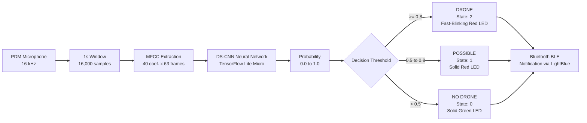

# Drone Detector — TinyML on Arduino Nano 33 BLE Sense

Real-time **indoor** detection of a drone's sound (DJI Mini 4 Pro) using a TinyML
neural network (DS-CNN) running **100% on-device** on an Arduino Nano 33
BLE Sense Rev2 — no cloud, no Wi-Fi, no server. Audio is captured by the
onboard PDM microphone, processed and classified locally in under 1
second, with visual (RGB LED) and Bluetooth (BLE) indication.


## Demo

- 🟢 Green LED: no drone
- 🔴 Solid red LED: drone detected
- 🔴 Fast-blinking red LED: drone detected with high confidence
- 📶 Bluetooth (BLE): broadcasts state and probability live, readable by
  any generic BLE app (e.g. [LightBlue](https://punchthrough.com/lightblue/))

<p align="center">
  <br>
  <em>Arduino Nano 33 BLE Sense detecting the drone in real time</em>
</p>

## How it works



The MFCC pipeline (FFT, mel filterbank, DCT) is computed **in pure C++ on
the Arduino**, replicating `librosa.feature.mfcc()` (used during training
in Python) bit for bit — validated with a numerical difference below
0.002 against the original `librosa` output (see
`python/06_export_arduino_assets.py`).

## Hardware required

- Arduino Nano 33 BLE Sense **Rev2**
- USB data cable (Micro-USB or USB-C adapter, depending on your computer)
- (Optional, to reproduce the fine-tuning step) a drone to record your own audio

## Repository structure

```
.
├── python/     # Training pipeline (dataset -> model -> .tflite -> .h files)
├── arduino/    # Firmware (.ino) and generated assets (.h)
├── requirements.txt
└── README.md
```

Scripts are meant to be run **from the repository root**
(e.g. `python python/01_prepare_dataset.py`). See `python/README.md` and
`arduino/README.md` for details on each part.

## Dataset

This project uses the **DroneAudioDataset** (binary: `yes_drone` /
`unknown`), compiled by Sara Al-Emadi et al. as part of *"Audio Based
Drone Detection and Identification using Deep Learning"*:

> Al-Emadi, S. et al. *Audio Based Drone Detection and Identification
> using Deep Learning*. IWCMC 2019.
> Dataset: https://github.com/saraalemadi/DroneAudioDataset

The dataset is **not included in this repository** — download it directly
from the link above and place it in `dataset/yes_drone/` and
`dataset/unknown/` before running `python/01_prepare_dataset.py`.

## The journey (technical summary)

This project went through a few pivots before reaching the final result —
documented here because each one taught something:

1. **Original architecture (~8k parameters, no spatial downsampling)**
   trained well on the PC (99% test accuracy), but generalized poorly to
   real audio until a first fine-tuning pass with personal recordings.
2. **Attempted deployment via Edge Impulse (BYOM)** ran into free-tier
   limitations (paid EON Compiler) and RAM overflow — the model requested
   >1MB of runtime RAM because the architecture never reduced the spatial
   resolution of its activation maps.
3. **Migration to plain TensorFlow Lite Micro** (no Edge Impulse),
   rewriting the architecture with `strides=2` across 4 blocks, shrinking
   the largest intermediate tensor from ~645KB to ~60KB.
4. **A fine-tuning run using phone-recorded audio barely worked**
   (55-64% accuracy) until two problems were identified: insufficient
   capacity in the first "too lightweight" version, and later a
   `BatchNormalization` effect un-learning good statistics on a small
   dataset.
5. **Discovery of the microphone domain gap**: the model fine-tuned on
   phone audio worked well on the PC but failed on the real Arduino — the
   PDM microphone "hears" differently than a phone microphone. Fix:
   record the fine-tuning data **with the Arduino's own microphone**
   (`arduino/record_and_dump/` + `python/03_record_via_arduino.py`).
6. **Final RAM optimizations** to fit model + MFCC buffers + Bluetooth
   (BLE) inside the nRF52840's 256KB: C++ string literals instead of
   comma-separated arrays (lighter to compile), removal of redundant
   intermediate buffers, and fixed-point (int16) instead of float where
   the extra precision didn't matter.

Final result: **96.55% validation accuracy** after fine-tuning with audio
recorded through the Arduino's own microphone.

## Known limitations

- Mostly tested in **indoor environments** at ~0.5-10m from the drone; outdoor
  performance under wind and environmental noise has not yet been validated.
- The personal fine-tuning dataset is small (16 five-second recordings);
  more recordings, across more conditions (distance, angle, environment),
  would likely improve robustness.
- Tested with a single drone model (DJI Mini 4 Pro); does not validate
  generalization to other drones without new fine-tuning.

## Credits and third-party libraries

- [DroneAudioDataset](https://github.com/saraalemadi/DroneAudioDataset) — Sara Al-Emadi et al.
- [ArduTFLite](https://github.com/spaziochirale/ArduTFLite) / [Chirale_TensorFlowLite](https://github.com/spaziochirale/TensorFlowLite_Chirale) — TensorFlow Lite Micro for Arduino
- [arduinoFFT](https://github.com/kosme/arduinoFFT) — FFT in C++ for Arduino
- [ArduinoBLE](https://github.com/arduino-libraries/ArduinoBLE) — Bluetooth Low Energy
- [librosa](https://librosa.org/) — audio processing in Python

## License

This project's own code is under the MIT License — see `LICENSE`. The
third-party dataset used for training has its own terms; check the
original repository before redistributing it.

## Author

Ighor Ribeiro
